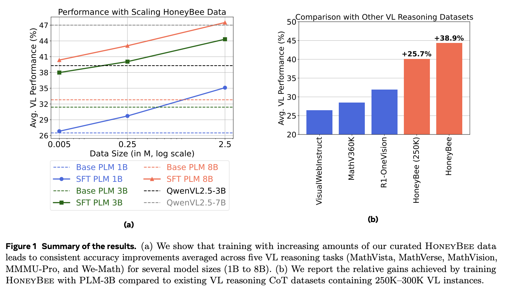
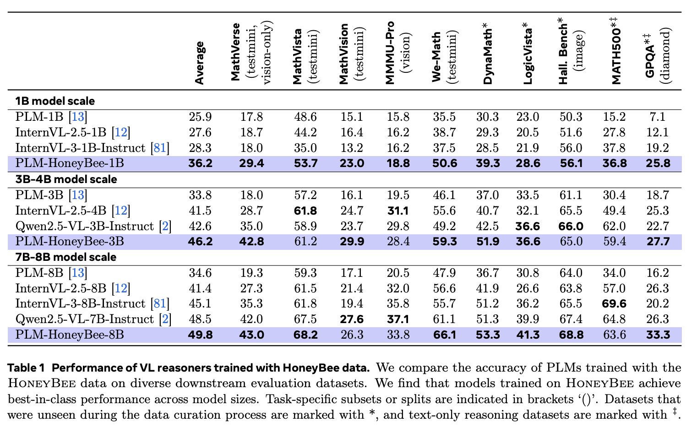

# HoneyBee: Data Recipes for Vision-Language Reasoners

This is the official repo for the paper: https://arxiv.org/abs/2510.12225.

Dataset is available on huggingface: https://huggingface.co/datasets/facebook/HoneyBee

## Abstract

Recent advances in vision-language models (VLMs) have made them highly effective at reasoning tasks. However, the principles underlying the construction of performant VL reasoning training datasets remain poorly understood. In this work, we introduce several data curation approaches and study their impacts on VL reasoning capabilities by carefully controlling training and evaluation setups. We analyze the effects of context (image and question pair) sources, implement targeted data interventions, and explore scaling up images, questions, and chain-of-thought (CoT) solutions. Our findings reveal that (a) context source strategies significantly affect VLM performance, (b) interventions such as auxiliary signals from image captions and the inclusion of text-only reasoning yield substantial gains, and (c) scaling all data dimensions (e.g., unique questions per image and unique CoTs per image-question pair) consistently improves reasoning capability. Motivated by these insights, we introduce HoneyBee, a large-scale, high-quality CoT reasoning dataset with 2.5M examples consisting 350K image-question pairs. VLMs trained with HoneyBee outperform state-of-the-art models across model sizes. For instance, a HoneyBee-trained VLM with 3B parameters outperforms the SOTA model and the base model by 7.8% and 24.8%, respectively, on MathVerse. Furthermore, we propose a test-time scaling strategy that reduces decoding cost by 73% without sacrificing accuracy. Overall, this work presents improved strategies for VL reasoning dataset curation research.




## Evaluation

1. We provide a self-contained evaluation code for all the 10 eval datasets used in this work.
2. Currently, the script works for the base PLM models (in huggingface format) that do not generate chain-of-thoughts (CoTs). But you can easily adapt to any other HF model. 
3. Installation: [`transformers`](https://github.com/huggingface/transformers) for model support, and [`mathruler`](https://github.com/hiyouga/MathRuler) for grading.
4. Launching generations on multiple GPUs:
```
    torchrun --nproc-per-node 8 eval_plm_multi_hf.py --dataset mathverse --model_path facebook/Perception-LM-1B --name plm1b
```
5. Scoring generations:
```
    python score.py --output_dir outputs/mathverse_plm1b/
```

## Training

1. We are not planning to release the trained VLMs. But, you can use the publicly available dataset to train custom VLMs.
2. The code for training Perception LMs is already publicly available at: https://github.com/facebookresearch/perception_models
3. We provide the training yamls in [configs](configs/).

## Results of Training PLMs with HoneyBee



## License 

Use of this repository and related resources are governed by CC-By-NC. More details are present in the [LICENSE](LICENSE) file.

## Citation

```
@article{Bansal2025HoneyBee,
  title={HoneyBee: Data Recipes for Vision-Language Reasoners},
  author={Hritik Bansal and Devandra Singh Sachan and Kai-Wei Chang and Aditya Grover and Gargi Ghosh and Wen-tau Yih and Ramakanth Pasunuru},
  year={2025},
  url={https://arxiv.org/abs/2510.12225}
}
```